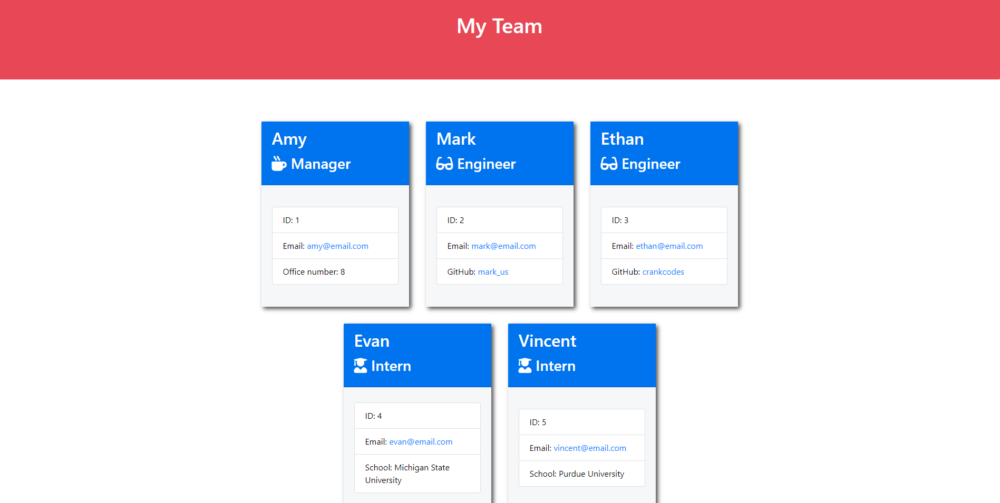

# team-profile
Module 10 Challenge - Object Oriented Programming

[Video Demonstration](https://drive.google.com/file/d/1rG4XwyyYu16q0Fzu6AZe_U5QIFOrtBj9/view)

## Installation
1. Clone repository
2. Install [npm i node](https://www.npmjs.com/package/node), [npm i inquirer](https://www.npmjs.com/package/inquirer), and if testing [npm i jest](https://www.npmjs.com/package/jest)
3. Run 'npm start' in your terminal

## Description
This project allows companies to use their terminal to add employees based on their position.

## Usage
Upon starting with 'npm start', you will be prompted to enter the name of the manager as well as their ID number, email address, and office number. You will then be asked if you want to add more team members by adding either an Engineer or Intern (or no more if there's no one left to add). Upon selecting Engineer, you will be asked for this employee's name, ID number, email address and GitHub username. If selecting Intern, the prompts will ask for name, ID number, email, and their current school.